# Portfolio Roadmap Planner

Automates creating a road map from a list of portfolio projects.    Simplifies enterprise portfolio planning and roadmap creation using resource availability combined with prioritized programs and projects.  

It is based on the premise that once you have developed a prioritized set of projects and know what resources the enterprise is willing to fund then you can predict delivery by consuming available resources to work on the highest priority projects first.         

> The ultimate goal is to make it easier to move projects in priority and to try different resourcing ideas and see how they  will ripple through to effect delivery of end of the overall portfolio of projects. 

The system will automatically seek to run as many projects in parallel as it has available resources. 
A higher priority project may be deferred if all the required resources are not available.  A lower priority project maybe worked because all of the resources required for the smaller project are available. 

Business conditions and priorities change.  As such any list of "must have by date" projects also changes as new customer demands or regulatory changes occur.   What is absolutely required for a given date will change when a business demand with a  higher priority thing arrives tomorrow.   Rather than using  "must have by" language it is better treat all projects as a list in  relative priority, if something of a higher priority is required then simply add it to the list with a high relative priority and allow the system to re-plan.  If you do not like answer then change the relative priorities or resource assumptions and allow the system to re-plan again. 

[Executable download](docs/builds)  [Main Project site](https://joeatbayes.github.io/portfolio-roadmap-planner/)  [Intro on Linked-in](https://www.linkedin.com/pulse/planning-your-enterprise-portfolio-using-automation-joe-ellsworth/)

## Sample Output

### Roadmap View

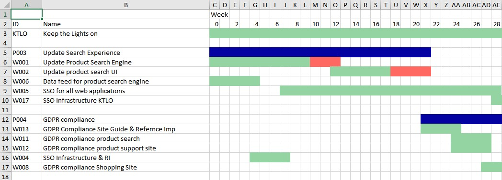

### Most Limiting resource by project

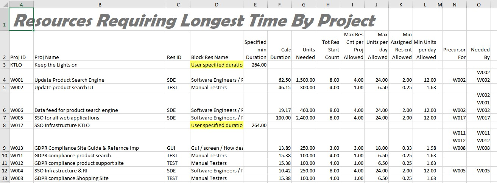

### Resource Utilization and Idleness

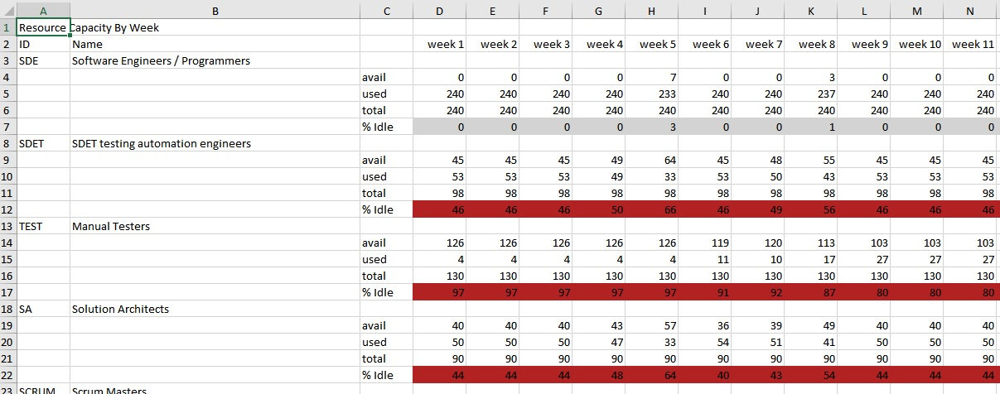

### Project Costs

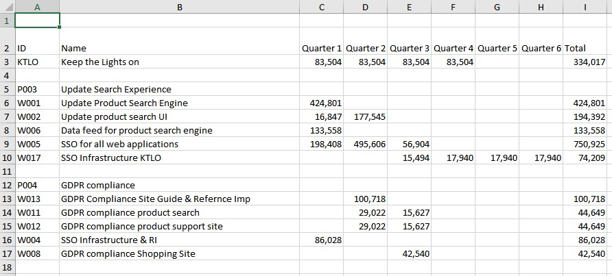

## Operating Assertions

* Multiple projects can be worked simultaneously provided all the available resources required to deliver the project 

* A single project can only be executed only if all Required resources available are available. A project must be deferred until all required resources area available to work on it. 

* A lower priority project may be worked if higher priority projects are blocked due to resource availability.

* A lower priority project may be worked before higher priority projects when it is listed as a precursor or requirement of the higher priority project.   Internally the system will escalate the priority of the precursor to be slightly higher that the dependent project.

* It is desirable to break projects into smaller projects with more specific resource requirements to ensure the smaller project can be worked sooner.  This can allow high priority projects to be completed more quickly since it is easier to find smaller groups of resources. sub project component of the higher priority project can be work.   To optimize project multitasking a program or project should be broken into multiple phases that name the parent larger parent project.   This allows the system to facilitate more precise resource leveling since the smaller group of resources needed for the smaller project are easier to make available.   The roadmap view is automatically adjusted to show the completion of the parent project stretching out until all sup projects can be completed.   Breaking a larger project into a larger number of smaller projects allows some higher risk components to be completed earlier thereby reducing total project risk. It also allows more total resources to be assigned since the max resource limits are assigned at the sub project level. 

* A resource group should be divided into smaller groups to make resource leveling more efficient.   For example rather than managing all of application development as a single pool it is better to use multiple pools such as group of testers, a group of developers,  a group of scrum masters,  a group of program managers, a group of business analyst.  This allows the system to determine resource hotspots more accurately and can  that way the system can more precisely determine what resource is blocking for execution. 

* A given project will always be blocked first by one resource group. This group will be the limiting factor for completion time.  Demands for other resources will be automatically throttled to complete their contribution at the same time the longest running resource completes.

* Since it is not efficient to assign all people to one very large project.  The system can limit maximum people from any resource group assigned to any project.  This can be specified most easily at the resource group level but may also be limited at the project level as an override.  

* Each project may name a one or more predecessor projects which must be completed prior to it's starting.   This is used to allow enabler projects that are required as input to other projects.

* When the system is forced to delay work on a give project due to resource availability it shows the blowing resources.  This can facilitate adjusting resources to better optimize workflow through the enterprise. 

  

[TOC]

# Basic Operation theory

The system reads two excel spreadsheets the first spreadsheet contains a list of resource groups along with the number of resources available each in group.    The second spreadsheet contains the prioritized list of projects including their resource requirements.  The output is generated as a new excel file that can be displayed side by side with prior runs to support what-if analysis.

What-if analysis is made easier because the same input project sets can be ran against many different resourcing scenarios and easily show the roadmap adjusted to reflect those resources.  This can make it easier to product to move projects in priority and see how it will Ripple through an effect delivery of end of the following projects. 

The system automatically manages the set of resources available to work on projects using the two separate inputs.  This allows many different inputs based on a on a assumed set of resources three years where each set of inputs can be named to make it easy to compare and contrast  different what-ifs outputs with an auditable evolution. 

**Avoid multiple cycles of must-have projects planning:**. It is desirable to avoid the notion of must deliver projects by a given date because business conditions change.  We also know that when you simply do not have adequate resources to deliver all must have projects the must have list will change.  This cycle wastes time and is emotionally exhausting.   It is preferable to simply change the project priorities so those most important for timely delivery are listed with higher priority.    If a project can not be delivered by the target date then simply change the resources or priority and allow the system to compute a new roadmap. 

If some projects have moved beyond acceptable promise dates then your available actions are:

1. Increase resources. 
2. Increase the priority of the projects that have been moved beyond an acceptable target-date.

The system internally manages a list of the prioritize projects and it will always seek to to provide resources for the highest priority project that has not been completed.   The only only time a lower priority project will be worked first is if the resources required at not available for the higher priority project. 

The system uses a 3rd excel file where the source columns for different types of information are specified.  This allows different input files to be used without changing the underlying source code.  This configuration file can also be used to control some aspects such as level of detail to show in the generated roadmap.

* If we know that column AA contains the resources required from application development.  That can be mapped to the appropriate resource on pool name even if there's not a direct correlated label match between the two sheets. 

The output of the system is generally in the form of a Excel file but the web version also generates direct web viewable outputs. 

### Web Version:

A web version where the project sheets can be supplied and uploaded from a browser may be supplied.  this version will display the projects, resource pools and generated roadmap.  New files can be uploaded and used to re-run  for different what-if analysis.  By allowing web access this will avoid the need to install the core utility as a local computers.

# Definitions

- **Resource:**  A resource is generally a person with a particular primary skill.   A given person may be a member of multiple resource groups but their budget of time must be divided between the groups.   A resource may also be a piece of equipment or external company that has a finite capacity.
- **Resource Group:** A resource group is a set or group of resources with a particular skillset.  A Resource  group is a group of resources qualified to work in a general area.   A recourse group is also known as a resource type.
  - **Resource Count:**  The total number of resources in the group.
  - **Resource Units per person per Day:**   The total number of resources available in a given resource group during a single day.  This is specified in the form of time units and is adjusted to reflect time available for work.   EG: If you have developers working 5 days  per week and they average 3 hours per day in overhead for email and meetings then they can only delivery 5 hours of net work per day.   We  can use this to determine that a team of 4 developers can deliver a total of 20 hours of work per day or 100 hours per week.    To make it easier to integrate with financial systems we actually track total hours and deduct anticipated overhead. This allows us to compute overall total cost better.
  - **Resource Cost:**  Each resource group is modeled with an average cost per person per time unit.  We also track total time units per year to make integration with financial models easier.
- **Resource Pool:**  The set of all resources across all resource groups. 
- **Project:**  A group of work that has a defined business goal and can be delivered in a quantified amount of time. 
  - **Resource Requirements:** A project must specify number of resources for each skillset required needed to complete the project.  For example a given project may require 50 hours of developer time,  10 hours a testers time and 3 hours of a scrum master.   These are generally specified in separate columns in the input spreadsheet.  These resources are mapped against available resources to determine when the project can be executed. 
  - **Parent Project:** A project may name a parent project.  The parent project will not be considered complete until all child projects are completed.    The nesting of children can be arbitrarily deep.  A project named by child projects may contain resources of it's own but it is generally better to list resources required in the child projects.   The parent project will start on the roadmap at the beginning of it's earliest child project and it's end will be the latter of completion of the last child project or when the resource requirements named in the parent project can be completed.
  - Each project must contain a unique identifying number or string that can be used to map it to other source sheets.   The unique identifier is used when specifying parent and prerequisite projects.
- **Program:** A program is treated as a large project that has at least 1 and generally several child projects.       The a program is simply a project that is referenced as the parent of multiple other projects.
- **Single Project Resource Limit:** Since resource groups are finite and we do not want all resources allocated to a single project We support a notion of maximum resources for a single project the system is allowed to specified. 
- **Time Unit:**  Planning is based on a time unit such as a week, hour or month.  Resources are always allocated based on the specified time unit.    Resource needs for a project  should always be specified in the same time unit.    Using smaller time units such as hours will generally allow the system to optimize paths more efficiently
- **Team:**  A set of resources generally composed of more than one resource group that are always assigned as a unit to work on any single project. 
- **Suppressed Projects:**  To produce a roadmap at a higher level suitable for sharing with executive some smaller projects can be suppressed while only their parent project is shown on the roadmap.  The level of suppression can be controlled and varied to support different audiences.

# Basic Operation

To operate the basic system we need to create at least 3 files.  A) A file containing a list of resources.   B) A file containing a list of projects.  C) A configuration file telling the system where to look in the other files.   To make things easier to manage the system can read a file or every excel file in a directory which allows the input files to managed in smaller chunks that are easier to manage. 

The system by default reads and generates excel files.   This choice was made to make it easier for end users who understand and use excel often to use the system without needing to learn how to directly edit JSON or YAML formats.

## Creating Resource File

 

The resource file tells the system about what resource groups are available,  how many of each resource is available,  How much of each resources will be available per day and the maximum number of resources that can be used for any single project.   If you name the directory containing the file the system will read every excel file in that directory.   You can name more than one resource file location to allow independent teams to manage their own file sets.   While we supply a default example here your resource sheet  may contain different columns.  Which columns, rows and sheets actually contain the data needed is specified in the configure file described below. 

It this example we chose to create a directory to contain the resource files.   The actual location here was a convention we use use where we place all our data in a data directory but that is only convention and it could be located anywhere it remains available to the system.

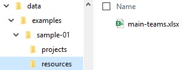

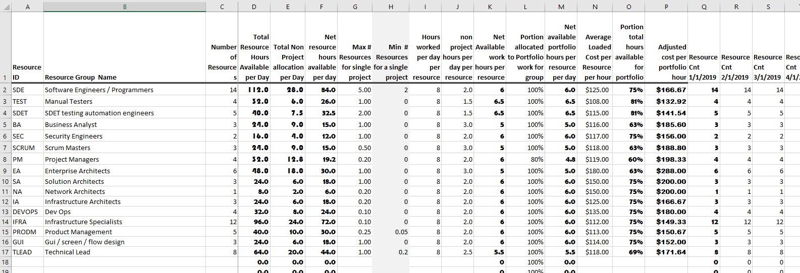

Source file [data/examples/sample-01/resources/main-teams.xsl](data/examples/sample-01/resources/main-teams.xsl) 

In this example we have populated some common resources.  The bold font columns are calculated automatically based on the contents  of the other columns.

* The number of resources is generally specified as number of people but could actually be a hardware unit such as the number of CPU cores.   In general increasing the number of resources will allow more projects to be completed simultaneously.  

* The Max # resources per project is heavily used by the system to determine how it should spread load across projects.  When it is fractional it such as 0.2 it would mean that a single resource must  support multiple projects.   If a sufficient amount of resources are not available then the project duration must be adjusted to allow delivery of the necessary resources.

* The Resources columns starting in column O are used to adjust staffing levels over time.  They default to start at the same number specified as the starting resource count and to stay the same until they are changed.   They are designed to be overridden by manually editing them in the month where resources are expected to change.  Once you change staffing level in one month it will automatically stay at new level until changed in a subsequent month.  There can be an arbitrary number of these resource columns but they must be configured in the setup file or the system will ignore them.

  

* 

## Creating Project Listing Files

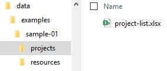

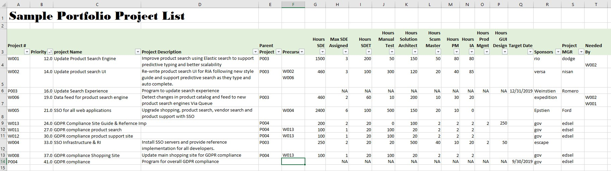

Source file [data/examples/sample-01/projects/project-list.xslx](data/examples/sample-01/projects/project-list.xslx)

- Project# is the Unique identifier for a given project.  The system will start reading data at the row specified in configuration and will continue reading project rows until it encounters a row with a empty project #.   
  - When a project has multiple numbers they must be separated or delimited by space or line feed and only the first project is used as the driving project #. The others are used as aliases to allow successful lookup by the precursor,  parent and needed by columns.
- Project priority is used as a sort key to process project lists between many input sets.
- Hours  required do not map directly by name to the resource names listed in resource.  This is explicit to allow a wide variety of input formats to be used as planning input.   The mapping of the columns for resources needed to defined resource groups is done in the config file described below.
- The precursor field means that another project must be completed before this project can be started.   It is possible to allow them to run in parallel by making them similar in priority and not explicitly stating the pre-cursor relationship.  When multiple precursor projects are defined they all must be completed before starting this project.    The precursor field is used to override priority and may cause lower priority projects to execute first.
- Parent project is used to group smaller projects together.  Naming a parent project creates a child relationship for the child naming the parent.  A parent project will start when it's earliest child is started and complete when the last child is completed.  At the current time a single project can only have a single parent but they can be nested to arbitrary depth to model work breakdown structures.
- Notice the Max SDE assigned this limits the number of SDE resources that will be assigned even if SDE are available in the resource pools.  This is required to allow parallel execution of many projects.  These limits per project are also set in the resource groups but they can be overridden here.  If more overrides are needed they must to added to the configuration file listed below.
- Needed by  should be filled to show which projects will need the benefits of this project but are not treating it as a  pre-cursor.  The system may be configured to not allow a project listed in "needed by" to be completed until all projects it needs are also completed.  This is different from a precursor where the precursor project must be completed the current project can be started.  A report is generated that shows projects needed by others that may cause timing issues.
- The hours needed columns from H to P are mapped to resource consumption.  They are used to determine when a project can be executed.   
- NPV business value is used by the optimizer to try and find recommended staffing and priority changes to maximize business value delivered per dollar invested.

## Creating Configuration Files

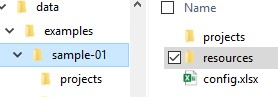

### Resource Configuration

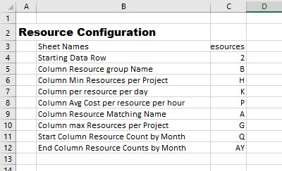

Source File:  [data/examples/sample-01/config.xlsx](data/examples/sample-01/config.xlsx#resources!a1) resources tab

Resource configuration allows the system to use a wide range of formats as input to describe resource groups and their availability.     These sections tell the system where to look in your sheet for specific data.

* **sheet names** - The names of the sheets in the input file to use as source data for resources.
* **starting data row** - First row that describes a resource group. This allows you to have arbitrary headers, formula and headers at top of the show.
* **column resource group name** -  TODO: Add description
* **column resource group start count** - TODO: Add description
* **column resource group net resources hours per day** - TODO: Add description
* **column resource avg cost per resource per hour** - TODO: Add description
* **column resource matching name** - TODO: Add description
* **column max resources per project** - TODO: Add description
* **column start column resources count by month** - TODO: Add description

### Project / Portfolio Configuration

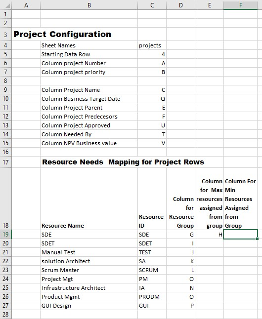

Source File:  [data/examples/sample-01/config.xlsx](data/examples/sample-01/config.xlsx#projects!a1)  projects tab

Project portfolio configuration allows a wide range of input spreadsheets to be used to describe desired projects.  There are a certain minimum amount of information required for each project but this approach allows column ordering best suited to the spreadsheet ordering.  project configuration tells the system where to look for various data.  

When a label includes first word column it means the system is to look in that column of the project list for the required data.

#### Resource Needs per project configuration

* **sheetname** - Sheet to open for the list of projects to analyze.
* **starting data row** - first row that contains project data.
* **column project number** - column that contains a unique identifying number for each project.   This must be  a unique number and is used for mapping both parent projects, precursor projects and needed by projects. The spelling and case must be an exact match for the system to work correctly.
* **column project priority** - The system will sort all projects by this priority when starting the planning process. If multiple input sheets are used they should collaborate to set priorities since projects will be processed in priority order from lowest number to highest number.    In some instances the system will override the priority if a precursor or project required to be completed first require it.
* **column project name** - project name is used in the generated roadmap as descriptive text.
* **column business target date** - Used to determine which programs or projects will be fail to be delivered soon enough to meet business needs.
* **column project parent** - When this is supplied the project is considered a child project of the named parent.   The parent project may be shown on the roadmap but it is adjusted to start when the children start and and end when the last child ends.    It is common to use a parent project to represent a program containing many children.
* **column project predecessors**  - When specified the named projects must be completed before this project can be completed.   If a predecessor is named and defined with a lower priority the system will automatically increase the predecessor priority to be slightly more important than the current project.
* **column project approved** - If defined in configuration the system will skip planning in projects in the roadmap unless they contain a "Y" in the approved column.   Leave this column blank if approval flag should not be used. 
* **Column Needed By** - TODO: Fill this in
* **Column NPV Business Value** - TODO: Fill this in

## Example Command Line:

TODO: Fill this section in.

# Operation using Web Browser

TODO: Fill this section in

## Example Web Invocation

TODO: Fill this section in

# Install and Configuration

TODO: Fill this section in 

## Important Files:

TODO: Fill this section in.

# More on Theory of Operation & Theory of Design

## Resource Consumption & Time of Operation

If I have 1500 hours for a developer and I know that I need need to allocate a maximum of 5 developers and I know that I get 6.5 hours of developer time per day per dev or 6.5*5=32.5 hours total Dev time per day.  Then I know that i need 1500 / 32.5 = 46.1 days to deliver the project.     If I know that I have 46.1 days to deliver 80 hours of IA time then I  need to deliver 80 / 46.1 = 1.73 hours per day of work.   The ratio of 1.73 / 46.1 = 0.0375.  The Ratio of 80 / 1500 =  0.4444     In other works for every hour of work delivered by Dev the largest demand we need to deliver 0.0375 hours of IA time.  

We need a way to spread resources across time and to determine if for a given day sufficient resources exist to start a project.  Since we already have the projects sorted in priority order we should always say the a project can be worked on if we have the minimum number of resources available in each category.   And if we can say the project under consideration is of the highest priority then we can guarantee that we will have resources available on future days because we will always give that project priority.

We need a notion that says we need a minimum of Number of resources available to meet the specification of the project and even if hours are available the project can not be started unless the minimum resource count can also be reached.   This is required for projects where you will need a minimum of 3 programmers and it does not make sense to start if you only have 1 available. 

There is no support for resource ordering within a single project but we do normalize delivery of resources so we can deliver all the work with all resources ending at the same time.   For instances where this will not work we can force work ordering using smaller projects under a common parent. and tying them together with a precursor project to guarantee proper ordering.    To support this resource balancing we compute a effective resource load Ratio for each resource mentioned in the project when it is loaded.  The load is based as a fraction of the largest resource demand.  In this way if we get X resources for the largest demand we can multiply by the ratio to obtain or weighted demand for the other resources.

For any single day for each resource in all groups we first need to determine how many hours of work are available for the day.  As we consume those hours we deduct that from hours available. while 
simultaneously reducing hours needed from that pool for the project.    To support this we project resources by day forward  from the starting point in a way that allows us to index into it by resource#, Day# and store  Hours Available,  Hours Consumed,  Which projects consumed those resources for that day.

If all the resources needed for a given project are available at the required daily rate. then we would allow work on that project.   We deduct the hours worked for that resource from total hours needed for the project and when total hours have been delivered we no longer need to allocate hours from that resource group. 

##### Thinking About Time, Days and Calendar Work Days:

Overlaying time with holidays and weekends on the main planning activity would add complexity in an area where we want the system to be very fast.  To avoid this we model a logical series of days and ignore weekends.  We then take this model and apply working days to the model to stretch it across calendar time.  The end result is we can still draw a calendar based roadmap but it allows us to ignore that complexity while doing the heavy calculations and optimization. 

# Known Limitations

* Project ID must be unique.  If the same project ID is listed on more than one row then the  last one known will replace the prior one.
* Project Aliases or those project ID after the first one shown must be unique.  If the same Alias is used by more than one project the last one encountered will replace all prior definitions using the same Alias.
* 

