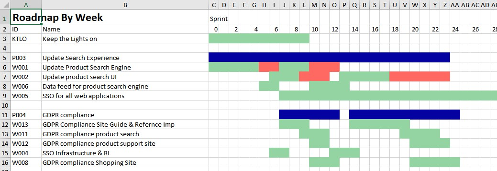
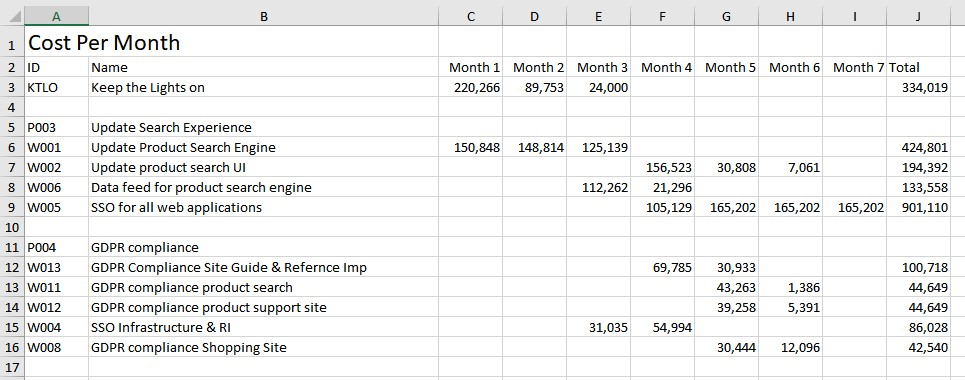
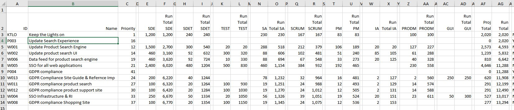
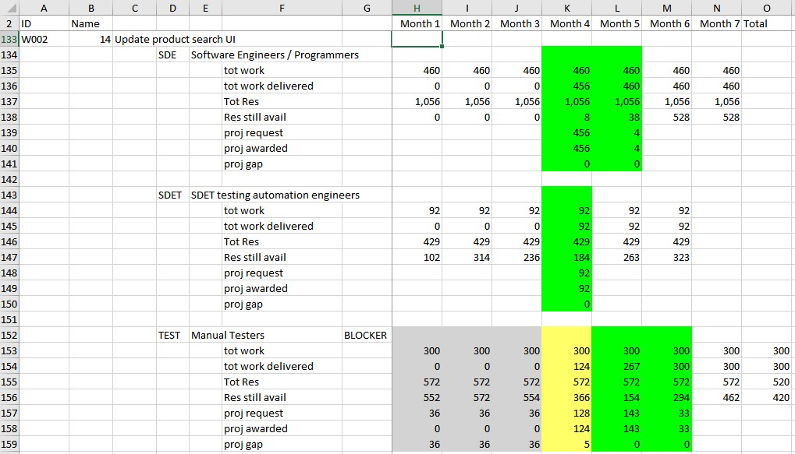
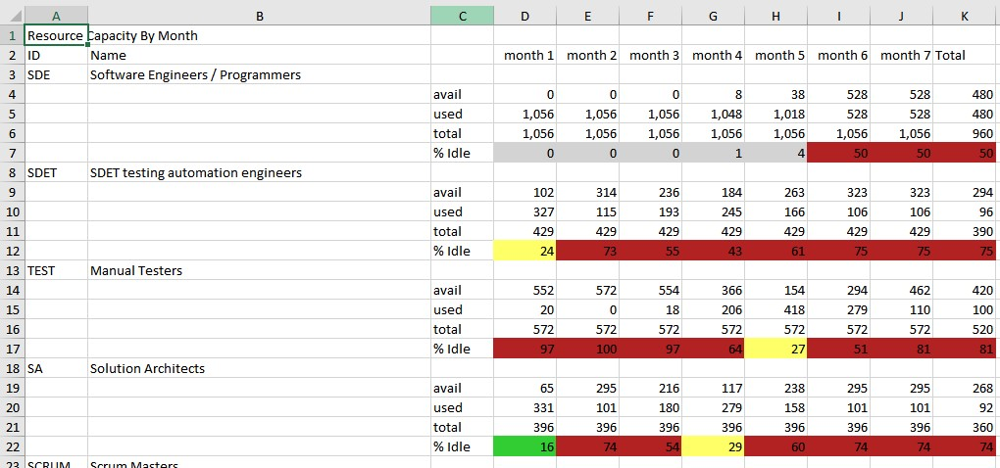
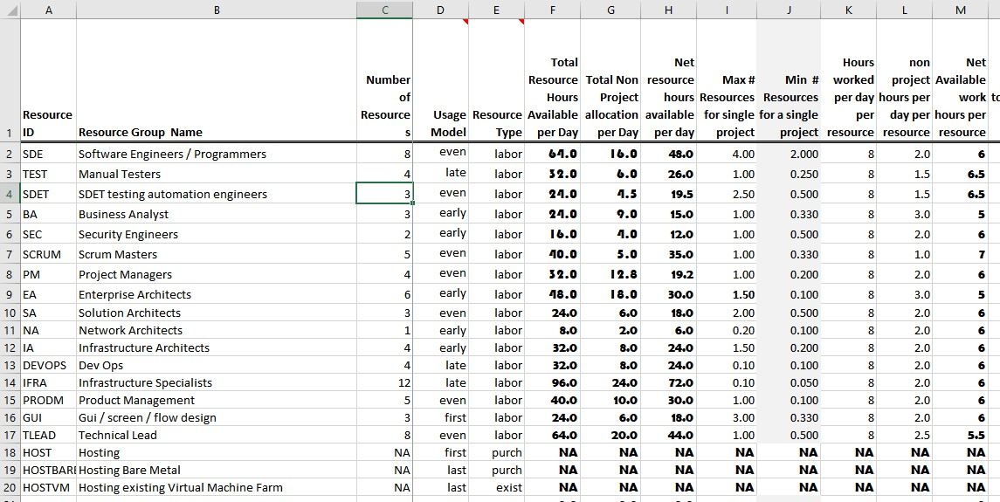

# Enterprise Portfolio Analyzer & Roadmap Generator

| Documentation                                                | Tutorials                                                    | Misc.                                                        |
| ------------------------------------------------------------ | ------------------------------------------------------------ | ------------------------------------------------------------ |
| [Main Readme & Overview](https://github.com/joeatbayes/portfolio-roadmap-planner) | [Overview article on Linked in](https://www.linkedin.com/pulse/planning-your-enterprise-portfolio-using-automation-joe-ellsworth/) | [Binary Builds on github](https://github.com/joeatbayes/portfolio-roadmap-planner/tree/master/docs/builds) |
| [Request Features](https://github.com/joeatbayes/portfolio-roadmap-planner/issues) | Planning a Version 1 Agile Board                             |                                                              |
|                                                              | Planning a Jira1 Agile Board                                 |                                                              |

# Introduction

Planning work form story cards or portfolio lists is essential to help business make value judgement based on  delivery times and costs.   It is also a expensive and time consuming process.   This article discusses how parts of the process can be fully automated so we can focus our scarce and expensive human effort on the the high value activities. 

## How it works.

* **Develop a list of projects in Excel**.  This can be produced as a excel spreadsheet like the sample below.  Or you can use an export from version 1 or Jira.  An important aspect is prioritizing these projects relative to each other and documenting how much of each resource you will need such as  100 hours of programming,   200 hours of marketing,  50 hours of test.  
* **Document a list of resources by unique resource group in an excel spreadsheet**.    This can be as simple as CTO, Marketing, R&D.  It can also be as detailed like  SDE,  SDET,  ScrumMaster, Lead.  It can also be by agile team.  The main rule is that you estimate project requirements using the same groups that you list in your resource group sheet.
* **Tell the system which columns of data in the input spreadsheets contain the important data**.  This is automatic if you use our sample format but we wanted you to be able to use any spreadsheet you wanted and this requires that you tell the software what columns contain the required data. This is done using a configuration spreadsheet.
* **Run the software giving it the excel files above as input**.  it will produce the roadmap and other output as shown below.    This generally takes under 2 seconds for smaller projects and as much as 45 seconds for very large portfolios.
* **Evaluate the roadmap produced and change the priority of projects or resource levels** This is normally done to move projects that will complete too late to meet your business goals.  Then re-run the software.   It only takes seconds so you can run many cycles until you get a plan you like. 

## Augmenting the planning process

Enterprise portfolio planning as part of the annual funding dance can be a hit or miss activity.   You invest  developing a list of projects, estimating those projects, selecting the projects that are absolutely must have only to find out that when combined with the lists from other departments that you have insufficient resources to do all the work.   

>  Part of this activity is highly valuable.  You really do need to have the discussions about which projects are the most important and what it will cost in hours & dollars to execute each project.    Other parts are better automated to preserve your time for the high value add activities like discussing project merit and priority with other groups and your customers.

You can not escape the high value human judgement work such as selecting which projects should be funded and determining about what it will cost  to execute each project.   some other parts of the process can be automated so you can invest more of your time doing high value work like setting relative priorities.

Once you develop a nicely packaged set of projects and present them to  executive decision makers it is very common to find they  are not satisfied with the the results and the planning cycle starts again.  the executives may have great reason such as:

- More resources.   ***"Can you deliver sooner if we fund more people?"***
- Lower resources.  ***"What if I have to cut your budget by 3 people?"***
- New projects.  ***"Legal just informed me that we have 120 days to become compliance with GDPR"***
- Deferred projects.   ***"August delivery for Project X will not work.  What if we defer Project A & B what is new date for X?"***
- Projects that are higher in priority.  "***New enforcement actions in NYC means we must have he Tax changes by Feb what is new plan?***"
- New Projects from new customers.   ***"I Just found out that Florida will buy 1000 seats and needs to be fully implemented by June next year?"***

Regardless of the reason all these changes require re-planning  time & energy.   Re-planning consumes bandwidth from people who could be delivering strategic value elsewhere if they were not tied up in the repetitive planning cycle.   Some work is required but this software can automate many of the error prone manual steps in the planning cycle.

Once you finally have a agreed upon list of projects and funding in may only survive for days before a change in the business needs,  a new sell or a simple miss results in a need to re-plan to accommodate new work.    

> Do your re-planning in minutes when new business brings new work. 

The software takes your list of prioritized and sized projects and produces a new roadmap with estimated costs in minutes.      It even shows you which resources are most blocking and and which teams have idle capacity.   You can use this information to optimize flow of work through the organization. 

Many times it is so time consuming to do the re-planning that it is skipped or you change something in one department planning and fail to realize that it impacts another.  This part of the process can be easily done by the software.   You as a human still need to supply the high value judgement of determining if the new plan is adequate and the negotiating changes in priority for projects that can not move.  Automating the tedious and error prone portions allows you to focus your time on high value add activities where human judgment is invaluable.

> When new high priority projects are injected do re-planning in minutes.

This software seeks to change the way we think about funding and planning as one integrated approach. Simply choose your resource levels, Prioritize and size your projects and let the system product the roadmap. If you do not like the results then change the priority or change the resources.

> You still have full control

> The software simply automates the manual error prone work out of the process.

> With this approach you can change your resource assumptions hundreds of times per day.

> Use what-if analysis until you find a combination of road-map and costs that are acceptable.

# Sample Output

## Roadmap by Month

The roadmap view shows you when the system was able to plan projects based on the priority and resources limits that you specify. If you do not like where a given item gets planned then change the priority and increase the resource limits for the blocking resources. Sheets to help diagnose blocking resources are shown below.

- The Blue lines are programs. They can be important because a single program such as "update Search Experience" are composed of many projects. A program starts when the first child project starts and finishes when the last child project finishes.
- The Green lines are normal working of the project.
- The Red lines are projects that will not finish until after their target dates. They indicate that you either need to increase that projects priority, increase resource levels or negotiate a new target date.
- The roadmap is shown several time granularity such as Week, Month, Quarter, Year to make it easy to grab granularity needed to show executives.

## Project Costs By Month

The costs view shows project costs based on when the system could plan the project based on available resources. It uses the average resource cost you entered in your resources spreadsheet. Different time intervals such as day, week, month, quarter, year are creates in separate tabs on the same output spreadsheet.

## Resource requests by Project

This resource requests by projects view shows the total set of resources requested for each project. It also shows a running total by resource and by all resources in project priority order. I use it to verify the resources I entered in the project list made it through and are shown correctly.

It has also turned out to be one of the most useful communication views because most SVP and CFO know how many total hours by resource type or how many total hours for all resources they have funded. In this view they easily scan down the running total column to see where they will run out of hours. The road-map view that accommodates cross team dependencies is more accurate but if the SVP expects the lower level mangers to right size their teams within total budget the more detailed view isn't something they worry about.

## Resource Usage By Month By Project

## Resource Capacity versus Used (Velocity  And Load)

This recourse capacity spreadsheet shows how much of your various resources you have consumed in each time unit. It is intended to help spot areas where you have idle capacity. When you have resource groups that are running at 0% idle capacity like the SDE below then it may be worth considering increasing those resources and reducing resources with excess idle capacity.

The time units such as by Day, By Week, By Quarter, By Year are generated on separate tabs of the same excel file.

# Sample Input

## Sample Input for Resources spreadsheet

In the resource group view you list each unique group of resources that may be consumed by projects. The Resource Id is used to link the resources defined here to the project list. You specify the number of resources, Overhead per day, The portion of their time available for program work and their costs. The system computes the rest.

This data is used to resource projects under the assumption that we always consume the resources requested for the highest priority project before giving those resources to a lower priority project.

- While this sample shows resource groups it is equally valid to use a team view. The only rule is that you need to be consistent between your project list and resource list. The team view is more common when planning from version 1 or jira exports.
- The columns to the right of S allow you to specify how many resources will be available for program work during the future. If you plan to increase team sizes in the future then you edit it here and the system will use those resources to increase or reduce the amount of labor available to resource projects. This column can also be used to account for reduced resources during vacations, etc.
- Usage Model - Even means to spread resource usage evenly across the life of the project. This is helpful for a project when you have 90 days of SDE time but only 9 hours of Product manager. It will take than 9 hours and allocate it evenly across the life the project.
- Resource Type - Used to indicate labor which is consumed over time and purchases that are one time events.
- Max Resources for a single Project - Used to limit the total number of resources that can be assigned from this resource group to any single project. Without this value the system would try to assign all resources to highest priority project. This value allows multiple teams to work. A value of 2 would indicate that no more than two complete resources can be assigned. Since allocation is done at units (hours) you can specify fractions.
- Min Resources for a single Project - This is used to prevent over fragmentation of resources. For example you would not one a single project manager to 100 projects. You would use something like a value of 0.2 so the system never allocates a single project manager to more than 5 projects.

## Sample Input for Project List Spreadsheet

You will need to edit this sheet to reflect your projects and estimated cost in time for each project. You can have as many different resource columns as desired. In general the more precise you are describing resource groups the more accurate the system can be when planning the projects.

> **Setting the priority column is critical** because the system will plan your projects in that order. There are times when priority can be overridden such as when a high priority project require a lower priority project to be completed before it can start.

1. You can have projects in several files to allow each business unit to edit their own lists but they do need to have the same data in the same columns. An exception to this rule is when using the system to plan Version 1 or Jira exports. Just put all the project sheets in one directory and the system will read them all to produce a unified plan.
2. **Priority:** A number that indicates this projects priority relative to other projects. The system will work the projects with the lowest priority number first unless overridden by precursor requirements or unless a higher priority project is blocked waiting for a resource while a lower priority project needs resources that are still available.
3. **Hours XXX (Hours SDE)** There are several hours columns in this sample for SDET, Manual Test, Architects, etc. You need one column per resource group you want the system to manage during planning. A smaller number of groups generally goes faster but the system can plan more precisely with more detail.
4. **Max XXX Assigned (Max SDE Assigned)** This allows you to override the maximum number of resources from the pool that can be assigned to this project. The default is set in the resource groups spreadsheet. You would add one of these columns for each resource group where you think you need the ability to override the default. If you enter nothing it will use the default.
5. **Target Date:** *Set target dates only when there is a business driver for delivery* of a specific project or program. It is generally better to set your priorities and let the system tell you when the projects can be executed based on your staffing levels.
6. **Project #** are an arbitrary string but it is used for matching with parent, precursor, needed by, etc so be consistent. Each project should have a unique project #.
7. **Precursors** contains a list of project # that must be completed before this project can start.
8. **Parent** contains a single project # that is a a parent project. The system uses this to group child projects together for some reports. When you list a parent for a project then that project implicitly becomes a child of that parent. This can be multiple levels and is the best way to easily produce an executive or boil up view. A program is simply a project referenced by at least one child which has no direct resource consumption.
9. **Portion Complete:** This number is used by the system to remove hours from consideration for forward looking hours. For example if you have a project that needs a total of 10,000 hours and mark it as 70% complete then it will only plan for the remaining 300 hours.
10. **Min Duration Days**: Enter the minimum number of days you want the project to span. By default the system will try to finish the project as fast as possible within the priority and resource limits you have specified. In some instances like providing maintenance it is necessary to force the project to span a full year and reduce the number of hours consumed to allow the project to span that time. This number tells the system to expand the project to fill the time while honoring the hours estimate. For example if you have a project that needs 90 hours and tell the system a minimum 30 day minimum duration then the system will only consume 3 hours per day from that resource.

## Detailed Execution & Wait Time View

Shows detailed execution for projects including the projects being blocked waiting for resources. This is built from the project priority, sizing and resource constraints you supplied in the project list and resource spreadsheets. Different time horizons are shown on separate tabs.

For large portfolios this can be a very large spreadsheet that may not load on smaller computers.